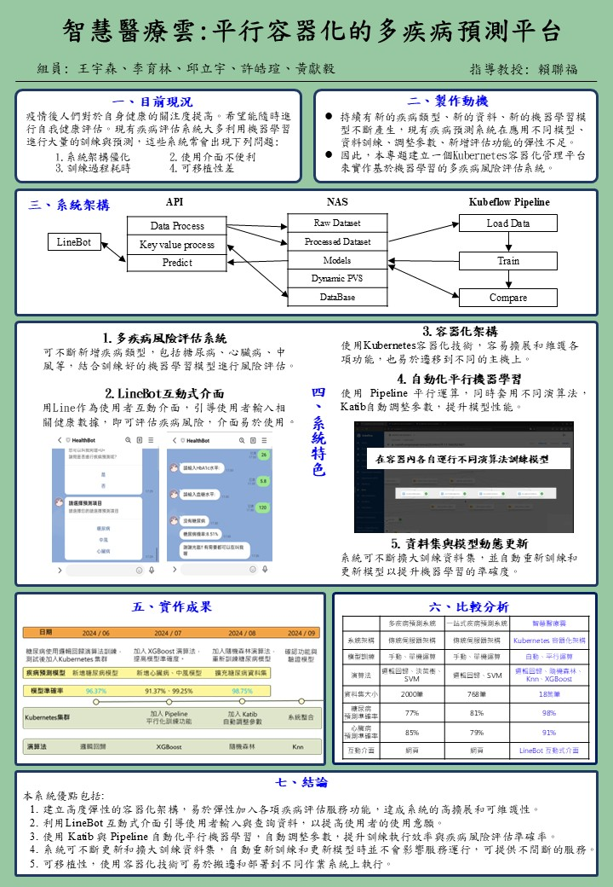

# SmartMedCloud - Multi Disease Predictor

## Overview

This repository implements a cloud-native, locally deployed platform for multi-disease prediction using parallel containerized architecture. Built on Kubernetes, the system supports modular integration and scalable execution of predictive models for diabetes, heart disease, and stroke — all within a local environment.

## 中文簡介

本專案實作一個雲原生架構的多疾病預測平台，採用本地 Kubernetes 部署，支援糖尿病、心臟病與中風等模組的容器化預測流程

---

## Project Overview

- **Objective**: To build a reproducible and scalable AI platform for predicting multiple diseases using containerized modules.
- **Architecture**: Parallel container orchestration via local Kubernetes (K8s), with independent preprocessing and modeling pipelines.
- **Modules**:
  - **Diabetes**
  - **Heart Disease**
  - **Stroke**

## Academic Context

This project is part of the research initiative titled *智慧醫療雲：平行容器化的多疾病預測平台*, exploring cloud-native design principles in a local Kubernetes environment.

  

